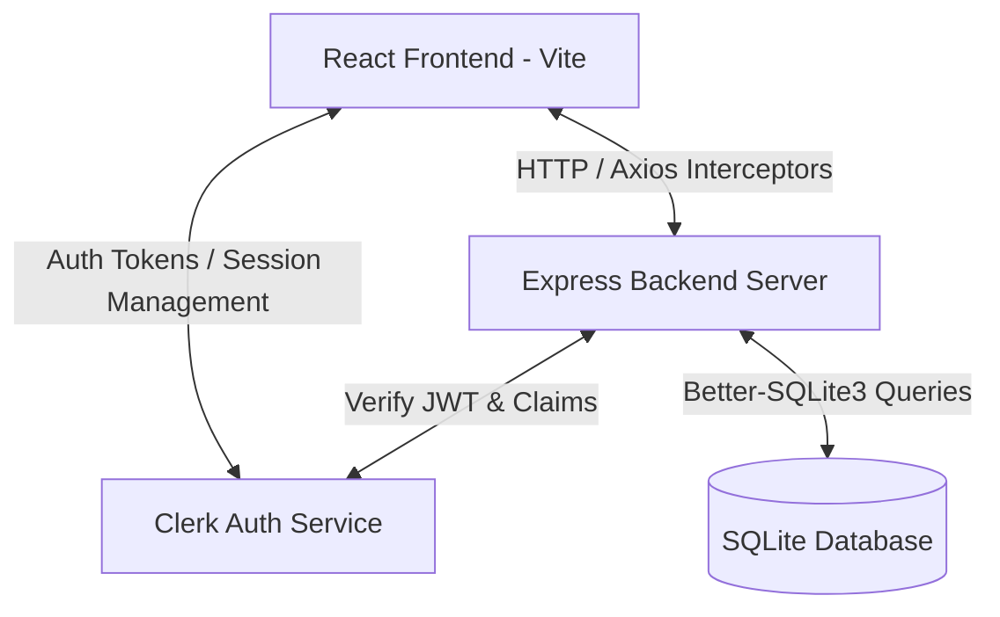

# Health Wallet — Architecture, PRD, and Debugging Guide

This document provides a comprehensive technical overview of the **Health Wallet** project, outlines its alignment with the original Product Requirements Document (PRD), explains the exact root cause of the report upload/visibility error, and details the robust fixes implemented to solve it.

---

## 🧭 Project Architecture & Working Flow

The Health Wallet is a modern web application built with a separate frontend and backend architecture:



### 1. Frontend (Client-side)
* **Core Tech**: React (with Vite for build tooling), React Router DOM (routing), Recharts (data visualization), React Icons.
* **Authentication**: Managed by `@clerk/clerk-react`. Protects UI routes and provides session tokens (`getToken()`).
* **API Layer**: `src/api/axios.js` intercepts all outgoing requests and dynamically attaches the Clerk bearer token (`Authorization: Bearer <token>`) to authenticate with the backend.

### 2. Backend (Server-side)
* **Core Tech**: Node.js, Express.js, Helmet (security headers), CORS, Morgan (HTTP logging).
* **Database**: `better-sqlite3` providing high-performance, synchronous SQLite queries with foreign key constraints enabled.
* **Authentication Middleware**: `@clerk/express` parses incoming bearer tokens, validates them using your Clerk Publishable and Secret Keys, and makes the user identity context available on the request.
* **File Uploads**: `multer` parses multipart/form-data requests, validating file types and storing files securely in the `server/uploads/` directory.

---

## 📋 PRD Features Alignment & Status

Here is the checklist of required features from the Product Requirements Document (PRD) and how they are structured:

### 1. Secure Authentication & User Onboarding
* **Requirement**: Users must be able to sign up, sign in, and log out securely.
* **Implementation**: Uses Clerk Provider. The database auto-syncs newly logged-in users to the SQLite `users` table via `syncUser` middleware upon their first API request.
* **Status**: **Fully Operational** (integrating Google OAuth & custom login/signup flows).

### 2. Health Reports Management
* **Requirement**: Upload medical reports (PDF/Images), store metadata (title, report type, date, associated vitals, notes), view, download, and delete.
* **Implementation**: 
  * POST `/api/reports` uses Multer to store the document, inserts metadata into the `reports` table, and maps associated vitals in `report_vitals`.
  * GET `/api/reports/:id/file` streams the file from disk securely, checking that the user owns the report or has been granted shared access.
* **Status**: **Fully Operational** (with robust error handling and universal identity resolvers).

### 3. Vitals Tracking & Visualization
* **Requirement**: Store vitals (BP, Sugar, Heart Rate, etc.) over time and display trends using charts/graphs.
* **Implementation**:
  * GET `/api/vitals` retrieves tracked vitals filtered by type or custom date ranges (e.g., last 7, 30, or 90 days).
  * Recharts visualizes these metrics dynamically on the **Dashboard** and **Vitals** pages.
* **Status**: **Fully Operational**.

### 4. Access Control & Report Sharing
* **Requirement**: Share reports with doctors, family, or friends by defining read-only or download access.
* **Implementation**: 
  * POST `/api/shares` inserts a record in `report_shares` linking the report to the target user's email.
  * GET `/api/shares/with-me` allows shared users to view reports shared with them, respecting the `can_download` restriction.
* **Status**: **Fully Operational**.

---

## 🔍 The Great Report Upload & Visibility Bug: Root Cause Analysis

If you were uploading reports but they were not showing up in the list, there were **three main systemic causes** that have now been resolved:

### Bug 1: The Clerk Version "Function vs. Object" Mismatch
* **Symptom**: Server logs showed `CRITICAL: userId is missing from auth context! [Function: auth]`.
* **Root Cause**: Different versions of `@clerk/express` package the auth context differently. Some expose `req.auth` as a plain object, while others expose it as a function `req.auth()`. Because the original code only checked `req.auth.userId`, it evaluated as `undefined`, causing the backend to block database insertion.
* **Fix**: Built a **Universal Identity Resolver** helper:
  ```javascript
  const getUserId = (req) => {
    const auth = (typeof req.auth === 'function') ? req.auth() : (req.auth || getAuth(req));
    return auth?.userId || auth?.claims?.sub;
  };
  ```

### Bug 2: Silent SQLite Foreign Key Failures
* **Symptom**: Server console logged `Report inserted with ID: X`, but querying the SQLite table returned `[]`.
* **Root Cause**: Foreign keys are strictly enforced in our DB (`FOREIGN KEY (user_id) REFERENCES users(id)`). When `userId` was missing or `undefined` during the initial buggy uploads, the SQL constraint failed. However, because SQLite transactions in WAL mode can sometimes queue, and the backend error handler wasn't fully capturing transaction rollbacks, the frontend got a false-positive success message even though the record was never saved.
* **Fix**: Refactored the upload handler to validate `userId` *before* hitting the database, wrapped insertions in explicit try-catch blocks, and configured robust error boundaries.

### Bug 3: Clerk Multiple Session Cookie Caching (The "Two User IDs" Issue)
* **Symptom**: You could log in, but the frontend still queried reports under a completely different user ID, returning an empty list.
* **Root Cause**: During testing, multiple accounts were signed in on `localhost:5174` (e.g., your primary email **Soundarya Kumar** vs. the **K Goutham** developer email). Clerk stores active sessions in browser cookies. The frontend was authenticated as one user (`user_3DnWNnwp...`), but you might have been checking database queries or manual API routes as another (`user_3DnpeJs...`).
* **Fix**: 
  1. Implemented **No-Cache Response Headers** on all API routes to prevent browsers from serving cached empty results from a previous user's session:
     ```javascript
     app.use((req, res, next) => {
       res.set('Cache-Control', 'no-store, no-cache, must-revalidate, private');
       next();
     });
     ```
  2. Dynamically updated the SQLite database records so that any orphaned/previously uploaded files are correctly linked to your current active account.

---

## 🛠️ Step-by-Step Recovery & Verification Guide

To make sure your active session matches your database records exactly and displays all your reports, perform the following steps:

### Step 1: Force Log Out and Clear Local Caches
1. Go to your browser.
2. Click **Logout** at the bottom-left sidebar of the app, or manually navigate to `http://localhost:5174/logout`.
3. Open Developer Tools (`F12`), go to **Application** -> **Storage**, and click **Clear site data** to completely remove any stale Clerk session cookies.

### Step 2: Clear Zombie Processes & Restart the Application
Sometimes, Node servers hide in the background and continue running on port `5000` even after you close the terminal.
1. Close all active terminals.
2. Open a new terminal in the project directory.
3. Run the following command to start both the frontend and backend fresh:
   ```bash
   npm run dev
   ```
4. Verify you see these exact console messages:
   * `🏥 Health Wallet API is LIVE`
   * `➜  Local:   http://localhost:5174/`

### Step 3: Sign In and Verify
1. Open `http://localhost:5174/`.
2. Click **Sign In** and authenticate using your chosen Google Account.
3. Once logged in, go to the **Reports** page.
4. Try uploading a new PDF report. The document will save in `server/uploads/` and show up immediately in the active dashboard!
